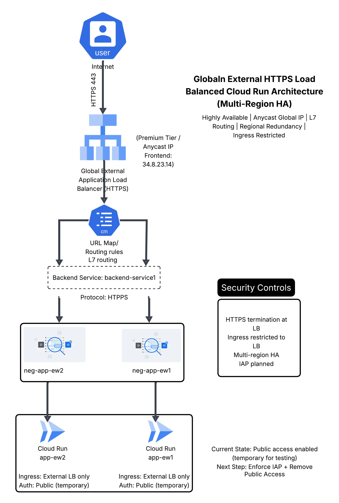
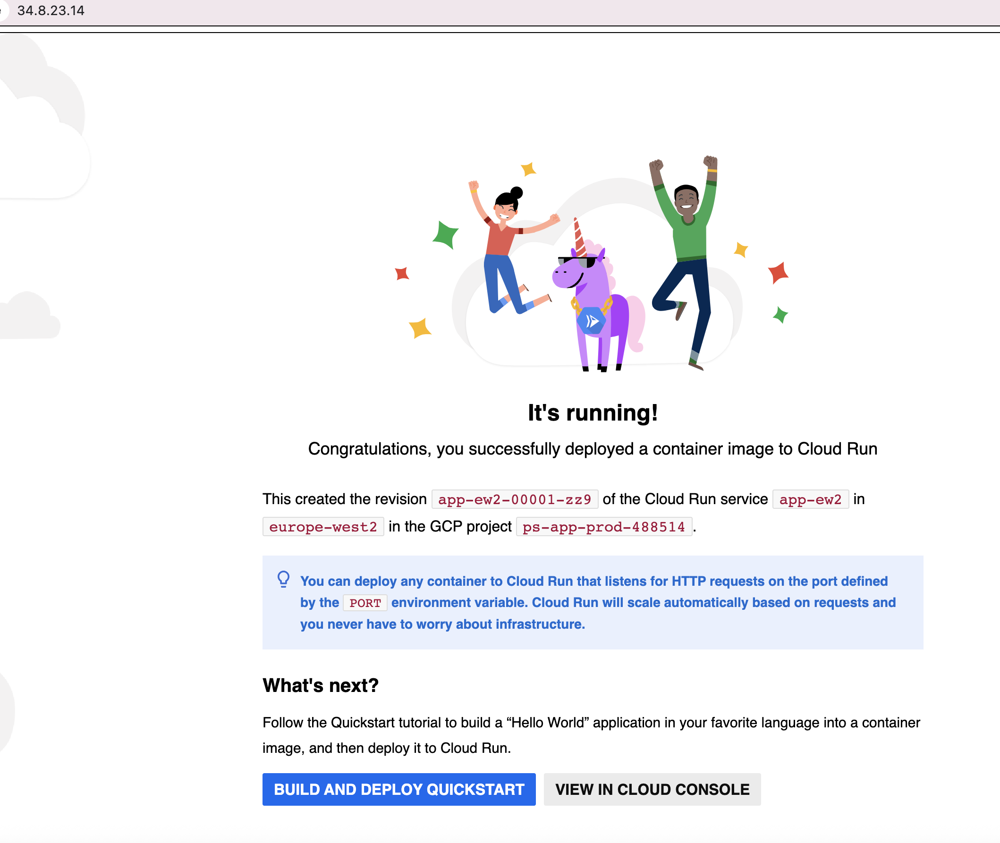
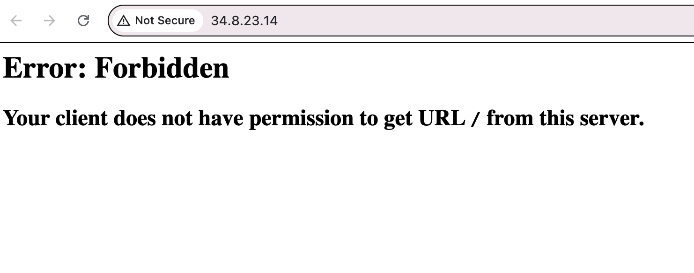
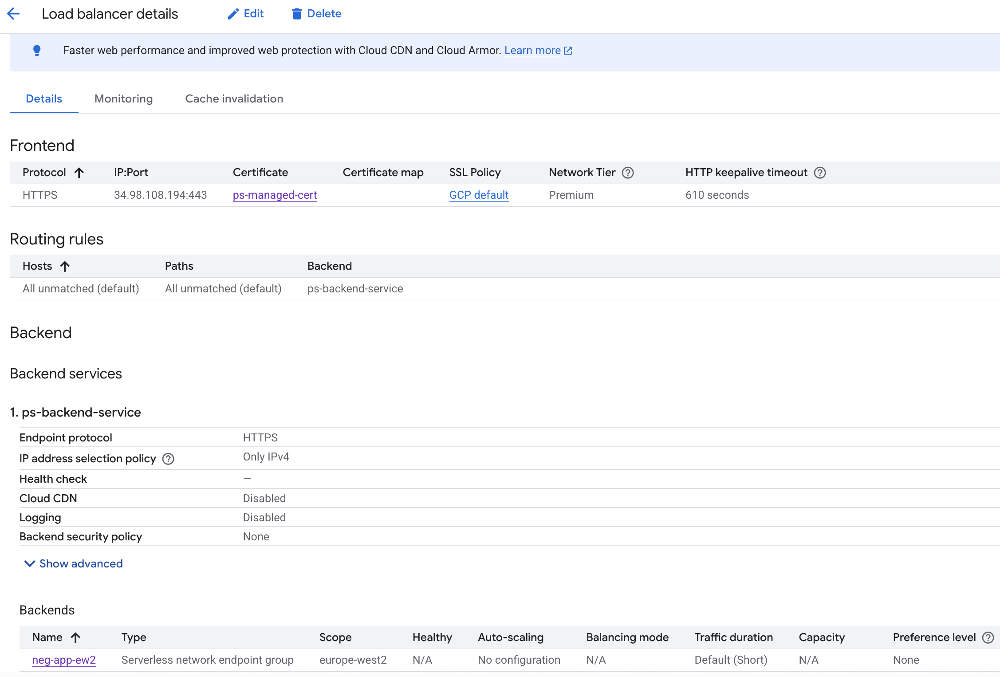
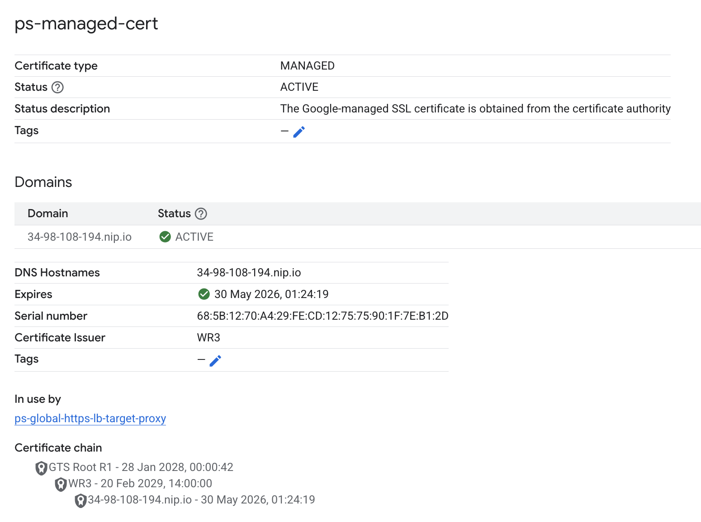
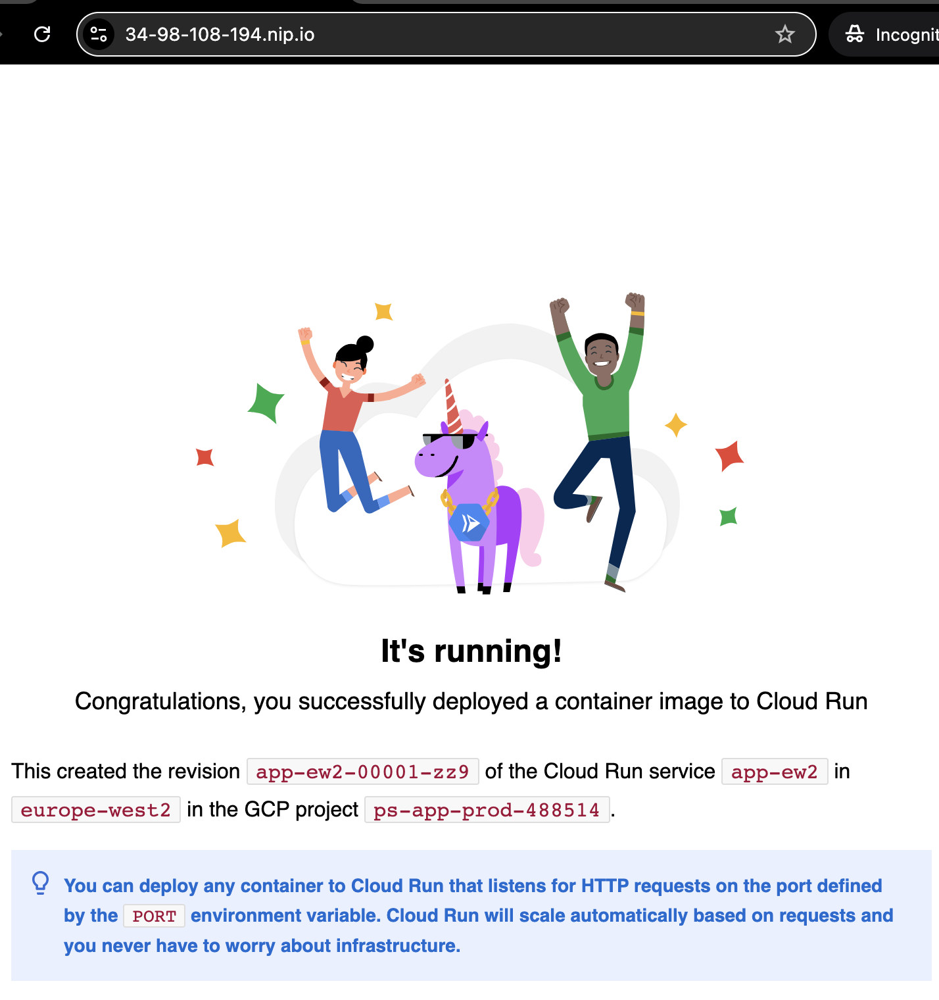
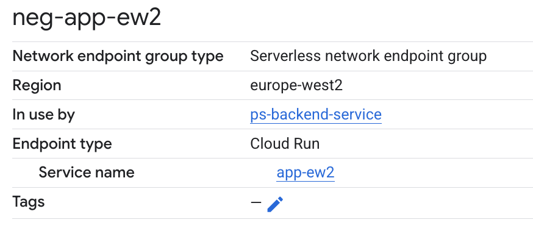
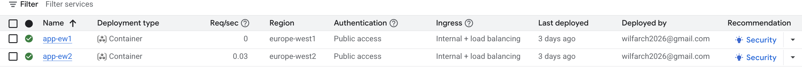

# GCP Multi-Region Public Sector Reference Architecture

Production-style, multi-region Google Cloud deployment validated using global HTTPS load balancing and managed TLS.

---

## Architecture Overview

---

## Architecture Summary

This project demonstrates the design and validation of a highly available, globally distributed serverless architecture suitable for regulated and public-sector style workloads.

### Core Components

- Global HTTPS Load Balancer (Premium Tier)
- Google-managed SSL certificate (ACTIVE)
- Multi-region Serverless Network Endpoint Groups (NEGs)
- Cloud Run backend services (europe-west1 & europe-west2)
- TLS termination at the edge
- Cost-controlled lifecycle (provision → validate → decommission)

---

## What This Demonstrates

- Multi-region architecture design
- Edge TLS configuration and certificate lifecycle management
- Serverless backend integration with global load balancing
- High availability patterns using regional redundancy
- FinOps awareness within GCP Free Tier constraints

---

## Current State

- Multi-region deployment operational
- Load balancer routing correctly
- Public access temporarily enabled for validation
- ✅ Identity-Aware Proxy (IAP) enforced at Load Balancer layer
- ✅ Backend services protected via OAuth2 identity validation

---

## Deployment & Security Evidence

### Successful Cloud Run Deployment (europe-west2)

---

### Direct Cloud Run Access Blocked (After Ingress Restriction)

After removing public invoker permissions and restricting ingress to Load Balancer only, direct service access returns HTTP 403 (Forbidden):

---

### Identity-Aware Proxy (IAP) Enforcement

- IAP enabled at Load Balancer backend service layer
- OAuth2 authentication enforced before request reaches Cloud Run
- Only authorised Google identities granted access
- Direct backend access blocked (403)

Architecture now follows zero-trust identity perimeter model.

---

### HTTPS Validation

Global HTTPS Load Balancer successfully provisioned with:

- Google-managed SSL certificate (ACTIVE)
- Serverless NEGs across multiple regions
- Cloud Run backend services
- Global static IP with TLS termination

Validated using nip.io domain mapping for TLS verification.

All infrastructure was decommissioned after validation to optimise cost.

---

### Architecture Validation Screenshots

#### Global HTTPS Load Balancer

#### SSL Certificate (ACTIVE)

#### Successful HTTPS Access via nip.io

#### Serverless Network Endpoint Groups (Multi-Region)

#### Cloud Run Backend Services

---

## Cost Management Strategy

All production-grade infrastructure was provisioned for validation and immediately decommissioned to minimise spend within GCP Free Tier constraints.

This demonstrates real-world FinOps awareness alongside architectural capability.

---

## Security Hardening Roadmap (next steps)

The validated deployment focused on TLS termination and multi-region availability.

Next-stage enhancements for production readiness include:

- Enforcing Identity-Aware Proxy (IAP) for zero-trust access
- Restricting Cloud Run ingress to internal + load balancer only
- Applying Cloud Armor WAF policies
- Enforcing organisation policy constraints for public endpoint prevention

